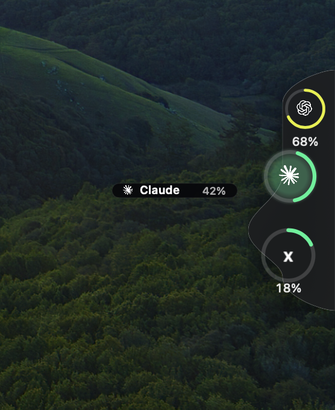

# QuotaRail

[](LICENSE)
[](#build-and-check--构建与检查)

[Download the latest release](https://github.com/Allan-Aa/QuotaRail/releases/latest) · [Changelog](CHANGELOG.md)

QuotaRail is a native macOS usage rail for Claude, Codex, Grok, and Cursor. It sits on the right edge of the active display, collapses to a small tab when not set to stay visible, and expands into a Dock-style usage rail.

QuotaRail 是一个原生 macOS 侧边额度栏，用来显示 Claude、Codex、Grok 和 Cursor 的可读取用量。它由固定的 rail window（负责鼠标命中和图标）与独立的 overlay window（负责 hover 标签和点击后的详情卡片）组成；hover 不会再通过改变 rail 窗口宽度实现。



## What it shows / 显示内容

- Codex reads recent local `rate_limits` events only. Prompt and response text are not displayed or saved.
- Claude uses the existing Claude Code login and its account usage endpoint. It does not estimate a percentage when the endpoint is unavailable.
- Grok reuses the existing Grok Build CLI login to read its billing usage. It does not import browser cookies or persist the OAuth token.
- Cursor reads Cursor.app's local login database in read-only mode. Cursor Grok Bot weekly usage is the primary ring; Cursor monthly included usage is secondary detail.
- The Settings window controls rail size, icon size, idle scale, hover scale, always-visible mode, and which providers appear. At least one provider remains visible.

All provider endpoints and local schemas can change. If QuotaRail cannot verify a real value, it shows an unavailable state rather than inventing a percentage.

所有供应商的接口与本地数据格式都可能变化。拿不到可信数据时，QuotaRail 会显示不可用，不会用猜测的百分比顶上。

## Build and check / 构建与检查

Requirements: macOS 13+, Swift 5.9+, and Apple Command Line Tools.

```bash
./test.sh          # compiles the app target, then runs core fixtures
./build-app.sh     # creates and ad-hoc signs dist/QuotaRail.app
./visual-check.sh  # rebuilds current source, then checks preview geometry/motion
```

`visual-check.sh` does not move the macOS system pointer. It validates the app's deterministic preview path, fixed rail/overlay geometry, and internal exit choreography. It is not a substitute for manually checking real `onContinuousHover` behaviour on the target Mac.

The repository does not ship a system-pointer injection driver. UI checks use app-internal preview states and read-only window metadata, so they do not move the user's macOS cursor.

## Install and upgrade / 安装与升级

```bash
./install.sh
```

The installer targets `/Applications/QuotaRail.app`, not a second copy in `~/Applications`. It builds first, copies to an `/Applications` staging directory, validates the staged bundle and signature, stops only the exact old QuotaRail process, moves the old app to `~/.Trash`, installs the staged app, then reads back the installed version and running path. Existing QuotaRail settings remain in macOS preferences and are not reset.

Write permission for `/Applications` is required. The app is ad-hoc signed and **not notarized**; on a new Mac, macOS may require right-click → Open. The installer prints the backup path so the prior app can be restored from Trash.

## Privacy and limits / 隐私与边界

- No telemetry and no QuotaRail server.
- No Codex or Claude hooks are installed.
- Tokens and session data are used in memory for a refresh and are not written to QuotaRail preferences.
- Cursor and Grok integration requires the corresponding locally installed and signed-in app/CLI. Without it, live usage cannot be verified.
- Automated checks use fixtures and preview data, not a real Keychain or real provider account.

## Release artifact / 发布产物

`./build-app.sh` produces `dist/QuotaRail.app`. The bundle contains the executable, provider artwork bundle, `AppIcon.icns`, `LICENSE.txt`, and `THIRD_PARTY_NOTICES.md`; it is verified with ad-hoc code signing. For a public release, distribute that `.app` in an archive together with its version and checksum, and describe the build as ad-hoc signed/not notarized unless a separate Developer ID signing and notarization step has actually been completed.

## License and attribution / 许可

QuotaRail is based on the MIT-licensed [Throttle](https://github.com/momenbuilds/throttle). The retained app icon and provider artwork are covered by the notices in [LICENSE](LICENSE) and [THIRD_PARTY_NOTICES.md](THIRD_PARTY_NOTICES.md). Provider names and marks remain trademarks of their respective owners.
