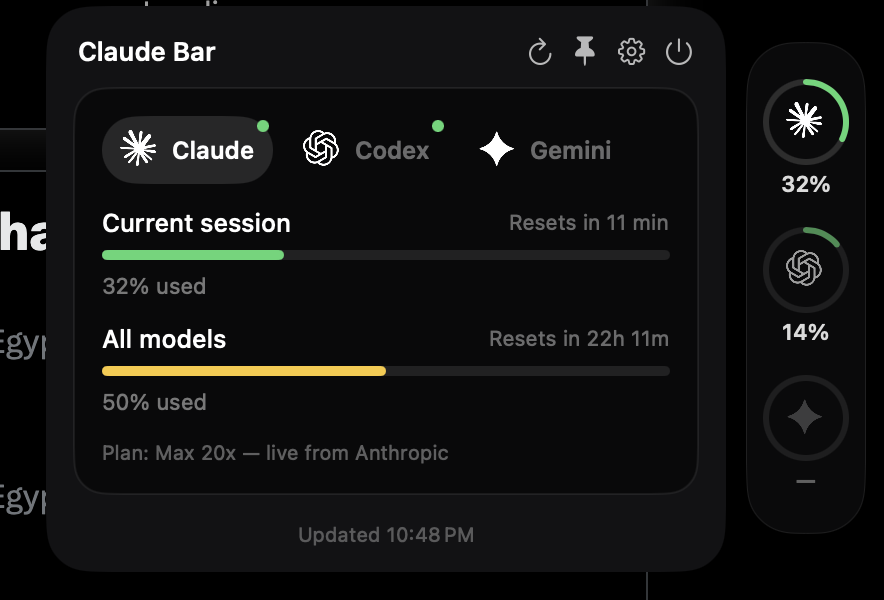

<div align="center">

# 🎚️ Throttle

**Your Claude, Codex, and Gemini usage — live, in your menu bar, with none of the guessing.**

[](#install)
[](#install)
[](Package.swift)
[](#license)



</div>

## Why

You're paying for a Max plan, or juggling Claude Code + Codex CLI on the same machine, and you keep finding out you're rate-limited *after* you hit send. Throttle puts the real numbers where you already look — the menu bar — and keeps them there.

- **Real, not estimated.** Claude's numbers come straight from Anthropic's own account API — the same one `/usage` uses — including your actual plan (`Max 20x`, `Pro`, etc). Codex's numbers come straight from OpenAI's API. Nothing is scraped or guessed unless you're signed out, and even then it's clearly labeled as an estimate.
- **Two surfaces, one source of truth.** A menu bar icon that shows your session % right in the bar, and a small pill docked to the edge of your screen for an always-visible glance. Switching tools in one instantly updates the other — no lag, no re-opening.
- **Get warned before you hit the wall.** An optional notification fires the moment any window crosses 90% used.
- **Actually looks like something you'd want open.** Real Claude/OpenAI/Gemini marks, status-colored rings (green → amber → red), no other app's UI kit bolted on.

## Install

One command, works on Apple Silicon and Intel — from this folder:

```bash
./install.sh
```

That builds a universal binary, drops `Throttle.app` into `/Applications`, and launches it. No Xcode project to open, no signing certificate to buy — just the free Xcode Command Line Tools (`xcode-select --install` if you don't have them).

Look for the gauge icon in your menu bar and the pill on the right edge of your screen. Open either one, tap the gear, and flip on **Launch at login** so it's just always there from now on.

<details>
<summary>Prefer to build it yourself?</summary>

```bash
./build-app.sh          # universal release build → Throttle.app in this folder
open Throttle.app        # try it without installing anywhere
```

Or for local iteration:

```bash
swift build
.build/debug/Throttle    # runs in place, menu bar only, no Dock icon
```
</details>

## What it shows

| | Session window | Weekly window | Plan | Source |
|---|---|---|---|---|
| **Claude** | ✅ live | ✅ live | ✅ (`Max 20x`, `Pro`, …) | Anthropic's account API |
| **Codex** | ✅ live | ⚠️ when OpenAI exposes it for your plan | ✅ | OpenAI's API, via Codex CLI's local logs |
| **Gemini** | — | — | — | see [why below](#gemini) |

Rings and bars are colored by how close you are to the limit — green under 50%, amber under 80%, red above — not by which tool it is, so a glance tells you what actually needs attention.

## Features

- 🟢 **Live usage rings** for Claude and Codex, in a floating pill and a detail panel
- 🔔 **Threshold notifications** — get pinged once a window crosses 90%, not after
- 🚀 **Launch at login**, toggled in-app (no manual Login Items fiddling)
- 🧲 **Draggable pill**, position remembered between launches
- 🖥️ **Universal binary** — one build, runs native on Apple Silicon and Intel
- 🔒 **Local-first** — talks only to Anthropic's and OpenAI's own APIs with credentials already on your machine; nothing else sees your data

## How the numbers work

- **Claude** — calls `api.anthropic.com/api/oauth/usage`, the same endpoint Claude Code's own `/usage` and `/status` commands use, authenticated with the OAuth token Claude Code already saved when you ran `claude login` (read from `~/.claude/.credentials.json`, or the macOS Keychain item `Claude Code-credentials` on newer installs). If you're signed out, it falls back to a cost-weighted estimate from local session logs (`~/.claude/projects/**/*.jsonl`), using real per-model $/token pricing compared against a budget you set in Settings — clearly labeled as an estimate, and it's allowed to show over 100% (in red) instead of silently capping.
- **Codex** — reads the most recently modified `~/.codex/sessions/**/rollout-*.jsonl` and takes the real `rate_limits.primary.used_percent` (and `resets_at`) that OpenAI's API already returns into Codex CLI's own logs. No estimation.
- <a name="gemini"></a>**Gemini** — Google shut down Gemini CLI's usage-quota API for individual Google accounts in June 2026 (Workspace/Enterprise accounts are unaffected). Since there's nothing honest to show for most people right now, this stays off rather than faking a number. If that changes, or if you're on a Workspace/Enterprise account and want it wired up, see `GeminiUsageEngine.swift`.

Brand marks (`Sources/Throttle/Resources/Brand/*.png`) are the real Claude/OpenAI/Gemini glyphs, sourced from [lobehub/lobe-icons](https://github.com/lobehub/lobe-icons) (MIT licensed) — an icon set built specifically for representing AI providers in third-party UI like this.

## Project layout

```
Sources/Throttle/
  main.swift                 NSStatusItem + tinted menu bar title
  LaunchAtLogin.swift         SMAppService wrapper
  UsageNotifier.swift         90%-threshold local notifications
  SelectionModel.swift        shared "which tool is selected" state (pill ↔ panel)
  DetailPanelWindow.swift     custom NSPanel (not NSPopover — see source comments for why)
  FloatingPillWindow.swift    draggable always-on-top NSPanel on the screen edge
  UsageStore.swift            polls the engines every 60s, publishes to both UIs
  Engine/
    ClaudeOAuthEngine.swift    real usage + plan from Anthropic's account API
    ClaudeUsageEngine.swift    fallback: cost-weighted estimate from local logs
    CodexUsageEngine.swift     real rate-limit % from OpenAI's API via local logs
    GeminiUsageEngine.swift    stub — see "Gemini" above
  UI/
    ContentView.swift          detail panel: tab row + session/weekly bars
    SettingsView.swift          login/notification toggles + budget calibration
    FloatingPillView.swift      compact ring strip for the pill
    RingView.swift              status-colored ring + StatusColor helper
    BrandMark.swift             loads the real provider marks
    BarRow.swift
  Resources/Brand/            claude.png / openai.png / gemini.png
build-app.sh                 universal (arm64 + x86_64) release build, ad-hoc signed
install.sh                   build + install to /Applications + launch
```

## Privacy

Throttle reads local files Claude Code, Codex CLI, and (in future) Gemini CLI already wrote to your disk, and makes requests only to `api.anthropic.com` and OpenAI's API using tokens those tools already stored. It doesn't run its own server, doesn't phone home, and doesn't share anything with a third party. It's not affiliated with Anthropic, OpenAI, or Google.

## License

MIT — see [LICENSE](LICENSE). Not affiliated with Anthropic, OpenAI, or Google; provider names and marks belong to their respective owners.
